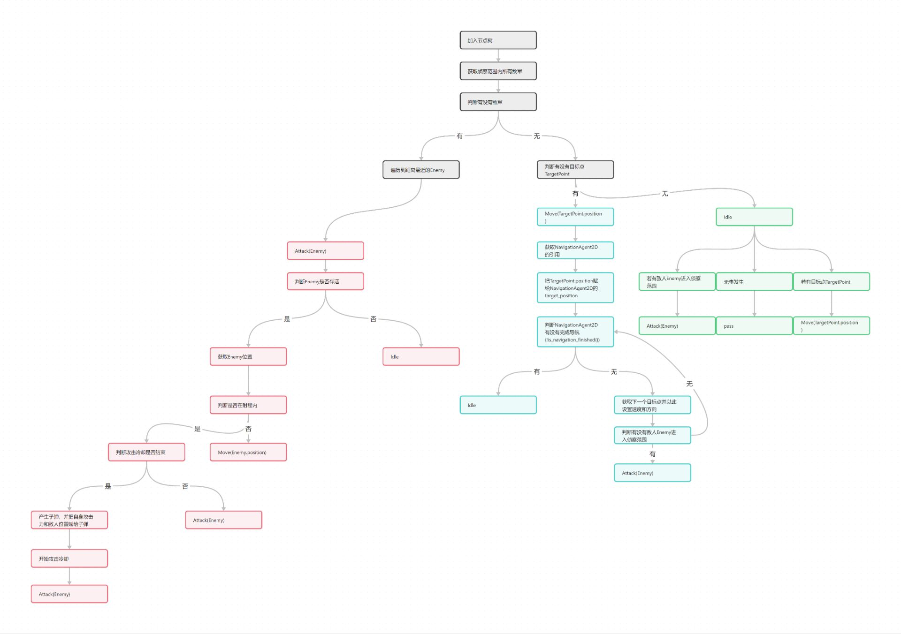
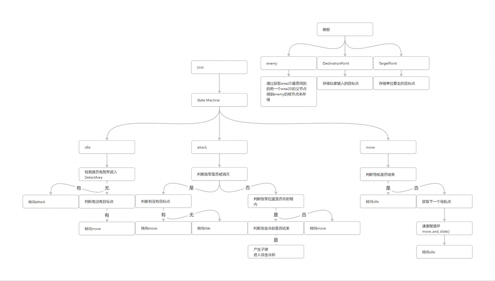

## 前言

我在使用godot开发一个RTS游戏的时候，我突然发现游戏中的单位(Unit)有且仅有三个动作（当时没有考虑"状态"，而是直接将这些定义为动作）：静止，移动，攻击，或者他们的组合（比如边移动边攻击，当然，别和我杠边静止边移动）

然后就诞生了这样一个无限递归函数的流程图：



可nb了，当时我就觉得，wow，我简直是一个逻辑大王，直到我知道这么做会栈溢出...

然后就去学了状态机，把上面的逻辑通过状态机写成了这样：



他们两个看上去逻辑是一样的，但区别就在上面的不能用，下面的能用，所以，状态机有什么用？

即答：让不能用的东西变得能用！（bushi

答：让actor个体（你说GameObject或CharacterBody也行，主要是我从虚幻开始学的，用actor习惯了）的行为用状态表示，从而**减少逻辑混乱，增强代码可维护性和可扩展性**

---

## 用硬代码实现状态机

### 逻辑

想象一下，我们只有一个enemy场景，和一个附着在enemy根节点上的脚本，这个脚本要全权负责enmey的巡逻，追逐，攻击逻辑（经典的patrol-chase-attack循环），我们该怎么写？

既然用状态机，那么我们就把这三个变成状态吧，我们有巡逻状态，追逐状态，攻击状态，自然，我们需要一个**枚举**来存储这个分类，还要有一个变量来存储**当前状态**，嗯，好，记得要做这两个

然后我们要处理一下动画，我们得三个状态显然要有不同的动画，那么我们就可以在更改当前状态时同步更改它的动画，那么要记得**在更改状态的函数中同步更新动画**

再者让我们想想，我们要怎么样更改状态呢，比如从patrol转到chase？或许你有许多种方法，比如添加一个Area2D然后把它的area_entered信号连接到根节点脚本中，但我们在这里还是只谈脚本中处理的方法

那么我们就需要知道玩家在哪，敌人在哪，当玩家与敌人近到一定程度时就更改状态，这里我们用硬代码直接在tick里写，**当我们的当前状态为patrol时，实时获取玩家与敌人位置，当二者距离小于侦查距离时，转换状态为chase**，chase到attack的转换同理，**二者距离小于攻击距离时，立刻攻击玩家，然后状态转为patrol**

以上，一个硬代码状态机就实现了，好了，那么纸上谈兵结束了，现在自己对照下面的代码看上面的解释吧

### 实现

那么就用一下硬代码实现一下状态机吧

这个硬代码是我从YouTube上一个老哥的博客学来的（啥不是学来的嘞，你说是不吼），以下是原帖，我改成了更简单的版本（原版是scanning-firing-charging循环，但我改成我觉得更简单易懂的patrol-chase-attack循环）

[Godot 4 中的启动状态机 - The Shaggy Dev --- Starter state machines in Godot 4 - The Shaggy Dev](https://shaggydev.com/2023/10/08/godot-4-state-machines/)

（这个文章里同时有硬代码方法和进阶状态机方法，看上半部分就行）

（记住，不要用硬代码写状态机，除非你敢拿头保证你不会增加很多很复杂的状态或复合状态！）

```gds
extends Node

enum STATE {
PATROL ,
CHASE ,
ATTACK
} #在此定义状态机中的所有状态

@export Player : PLAYER #对玩家引用来判断是否在侦查范围内

var current_state : STATE = PATROL #定义"当前状态"并赋初始值为PATROL
@export var animation : AnimatedSprite2D #这个动画状态机没有任何架构上的意义，你可以不用管它，我只是想突出状态应该要有的enter函数而已，让我的那个更改状态的函数变得不那么蠢

@export var detect_distance : float #侦查范围
@export var attack_distance : float #攻击范围

func change_state(new_state : STATE) :
	current_state = new_state
	match current_state :
		STATE.PATROL :
			animation.play("patrol")
		STATE.CHASE :
			animation.play("chase")
		STATE.ATTACK :
			animation.play("attack")
			change_state(PATROL)

func _process(delta) :
	match current_state :
		STATE.PATROL :
			if Player.position.distance_to(position) < detect_distance :
				change_state(STATE.CHASE)
		STATE.CHASE :
			if Player.position.distance_to(position) < attack_distance :
				change_state(STATE.ATTACK)

func _physics_process(delta) :
	match current_state :
		#这下面的函数我就不写了，毕竟重心不在实现enemy动作，而是实现状态机的结构
		STATE.PATROL :
			random_move()
		STATE.CHASE :
			move_to_player(Player)
		STATE.ATTACK :
			attack(Player)
```

结束了，框架没了，是不是很简单？对，状态机就是这么简单

---

## 用StateMachine父节点+STATE类子节点实现状态机

### 约定俗成

知道了上面硬代码实现状态机的方法，有一些东西我就不重复了，知识直接extends过来就ok

现在我们讲讲一个**状态**应该有什么

什么？什么叫应该有什么？这是什么意思？意思就是**状态**这个东西的规范形式

它会有四个函数，分别是

- Enter()
在状态改变为当前状态时调用，抽象理解为godot中的_enter_tree()

- Exit()
在离开该状态时调用，理解为_exit_tree()

- Update()
与_process()绑定调用，用于处理渲染

- Physics_Update()
与_physics_process()绑定调用，用于处理逻辑

以上都是约定俗成，但我觉得它们应该能对你理解接下来的代码有点帮助
### 实现与理解

以下是我适应的在godot中使用的状态机写法

原帖

[Finite State Machines in Godot 4 in Under 10 Minutes - YouTube](https://www.youtube.com/watch?v=ow_Lum-Agbs)

首先定义STATE这个东西，我们得知道STATE是什么，有什么默认函数（定义STATE类）

```gds
#STATE.gd

extends Node
class_name STATE #这里就是定义STATE

signal ChangeState #在要更改状态时发出信号，这个信号将附带有将要转向的状态的字符串形式，然后我们在状态机中用字符串查找到的状态来替换当前状态

func Enter() :  #这个函数将在进入该状态时调用
	pass

func Exit() : #在退出该状态时调用
	pass

func Update(delta) : #和_process绑定，用于处理渲染tick
	pass

func Physics_Update(delta) : #和_physics_process绑定，用于处理逻辑tick
	pass
```

为什么上面的函数都是空的？

因为后面会根据状态不同直接覆盖这些函数

然后就是状态机了，先想想状态机应该有什么？

状态机得：
1. 初始化状态（如果有）
2. 知道能有几种状态（状态的字典）
3. 知道当前状态是什么（知道当前要执行哪个状态的函数）
4. 能改变状态（有改变状态的函数）

没了！那就写吧！

```gds
#StateMachine.gd

extends Node
class_name state_machine

var state_dictionary := {} #这里是2
var current_state : STATE #这里是3
@export var init_state : STATE #这里是1


func _ready() :
	
	#这里是2
	for child in get_children() :
		if child is STATE :
			state_dictionary[child.name.to_lower()] = child #状态字典，键为状态的小写字符串形式，值为状态（子节点），这里的小写是用于保证代码安全的写法，避免因为大小写不同而检索不到相应的状态名
			child.change_state.connect(_change_state) #绑定信号到函数
			
	#这里是1
	if init_state :
		current_state = init_state
		current_state.Enter()

#这里是3
func _process(delta) :
	if current_state :
		current_state.Update(delta)

func _physics_process(delta) :
	if current_state :
		current_state.Physics_Update(delta)

#这里是4
func _change_state(new_state) :
	if current_state :
		current_state.Exit()
	current_state = state_dictionary[new_state]
	current_state.Enter()
```

接下来用patrol-chase-attack循环来演示状态节点

```gds
#patrol.gd

extends STATE
class_name PATROL

@export var enemy : ENEMY #这里是用引用的方法来让根节点实现当前状态的逻辑的
@export var player : PLAYER #引用Player检测玩家是否进入侦查距离

var detect_distance : float #侦查距离，当玩家与敌人的距离小于这一距离时，更改状态为chase
var wander_time : float #为了不用✓十timer，这里用最朴素的方法写计时器
var current_wander_time : float

func random_move() :
	pass
	#这里我就不演示了，反正就是enemy的运动逻辑

func Enter() :
	random_move()

func Update(delta) :
	if wander_time > 0 :
		current_wander_time -= delta
	else :
		random_move()
		current_wander_time = wander_time

func _Physics_Update(delta) :
	#当玩家与敌人距离比侦查距离小时，将状态转换为chase
	if player.position.distance_to(position) < detect_distance :
		change_state.emit("chase")
```

以上

这个状态机的思路就是：

- 给根节点一个节点StateMachine
- 在StateMachine下添加STATE类节点
- StateMachine实时调用current_state的逻辑
- STATE节点获得对StateMachine的引用实现更改current_state逻辑
- STATE节点获得对根节点的引用实现STATE逻辑

---

下面写一个进阶的状态机写法

ToDo（希望不鸽）